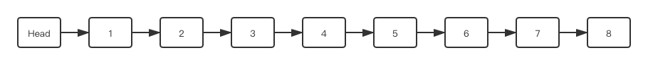
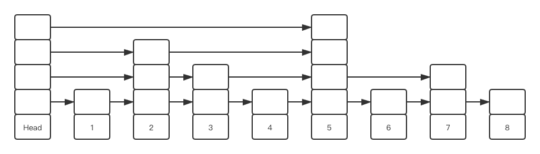

# 第5章 跳跃表

跳跃表用于进行均摊$O(\log n)$的增删查改。其主要用于有序集合的底层。

## 跳跃表基础

对于ACM选手而言，经常使用的$O(\log n)$的增删查改数据结构主要还是C++自带的`map`和伸展树、红黑树等基于二叉平衡搜索树的树状结构，故对跳跃表的概念了解较少（我在看这本书之前其实也忘得差不多了）。所以有必要对跳跃表做一下笔记。

先从普通的链表开始。普通的链表结构一般如下图所示：



而跳跃表本质上就是一个**多层链表**（空的方形表示指针）：



其只需要保证两个性质：

+ 列表本身有序
+ 当前列表的上一层列表节点数约为当前列表节点数的一半

那么显然的，其就可以均摊$O(\log n)$地做到二叉平衡搜索树能做到的事情

### 跳跃表的操作

+ 查找：从最上层列表开始找，如果发现找到区间了就往下一层，直到找到或到底
+ 添加：先找到要插入的点，插入节点并令其**生长**
  + 生长：这个节点一开始只有一层，然后开始随机等概率决定接下来的操作：
    + 加一层，然后回到随机决定这里再次随机
    + 结束
  + 事实上生长过程可以根据幂次定律直接生成一个1~32之间的随机数直接决定其有多少层。效果是一样的
+ 删除：查找，然后将节点去掉，就像链表一样

### 跳跃表与二叉平衡搜索树的比较

跳跃表可以做到概率上均摊为$O(\log n)$的增删查改操作，这和二叉平衡搜索树数相似（虽然大多数二叉平衡搜索树可以进一步做到最坏$O(\log n)$）。

其与二叉平衡搜索树相比最大的优点就是简单。容易理解容易实现，结构十分简洁。而且在简结的同时能够做到性能接近。

当然，如果真的要论性能的话优雅的二叉平衡搜索树还是优于跳表的（参考[这篇文章](https://segmentfault.com/a/1190000019745350?utm_source=tag-newest)的实验数据），而且树状结构可以玩出很多查询的花样（区间反转等），这都是跳跃表难以做到的。

> 有[文章](https://www.cnblogs.com/charlesblc/p/5987812.html)指出在并发环境下跳跃表性能可以优于二叉平衡搜索树。二叉平衡搜索树的操作本质决定了当要对其写入的时候需要将整棵树上锁。而跳跃表的写操作相对局部，在进行写操作的时候可以使用粒度更加小的锁来提高并发性能。
>
> 但事实上只要将二叉平衡搜索树的平衡操作进行拆分是可以提高锁的粒度的，不过想想就觉得实现起来超级麻烦。

## 跳跃表的实现

首先是节点的实现：

```c
typedef struct zskiplistNode {
  struct zskiplistNode *backward;
  double score;
  robj *obj;
  struct zskiplistLevel {
    struct zskiplistNode *forward;
    unsigned int span;
  } level[];
} zskiplistNode;
```

其节点跟链表节点一样，包含值和指针两个部分。

对于值部分，其包括：

+ 用于排序的分值`score`
+ 成员对象`obj`

Redis中跳跃表的排序准则是，先按`score`升序排序，如果出现`score`相等，则按`obj`升序排序（一般是其字符串的字典序）。

然后是指针部分，其包括：

+ 指向前一个节点的后退指针`backward`
+ 代表指针层的数组`level`。其中`level`的成员又包括：
  + 指向当前层的下一个节点的指针`forward`
  + 记录在当前层中，当前节点到下一个节点的跨度`span`
    + 所谓跨度就是两个节点的实际距离。例如在上面的跳跃表图里，节点2在第三层（从下往上数）的下一个节点是节点5，其中间跨过节点3和节点4，故其跨度为3。

然后是跳跃表本体：

```c
typedef struct zskiplist {
  struct skiplistNode *header, *tail;
  unsigned long length;
  int level;
} zskiplist;
```

首先是跳跃表的主体，包括两个指针：指向表头的指针和指向表的最后一个元素的指针。

需要留意的是，Redis的跳跃表包括一个**空的节点**作为表头。

接着就是一些辅助用字段，包括表的长度`length`和表当前的最大层数`level`。

